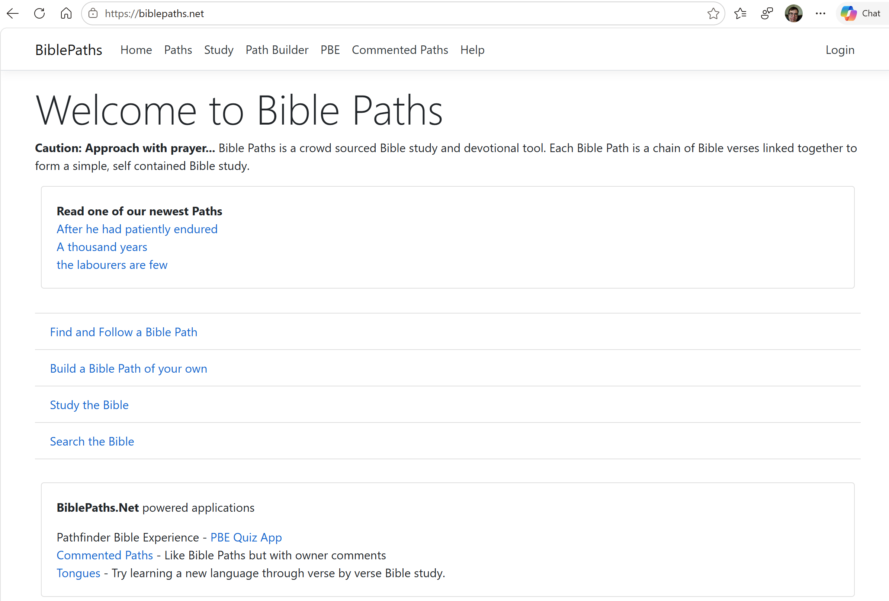
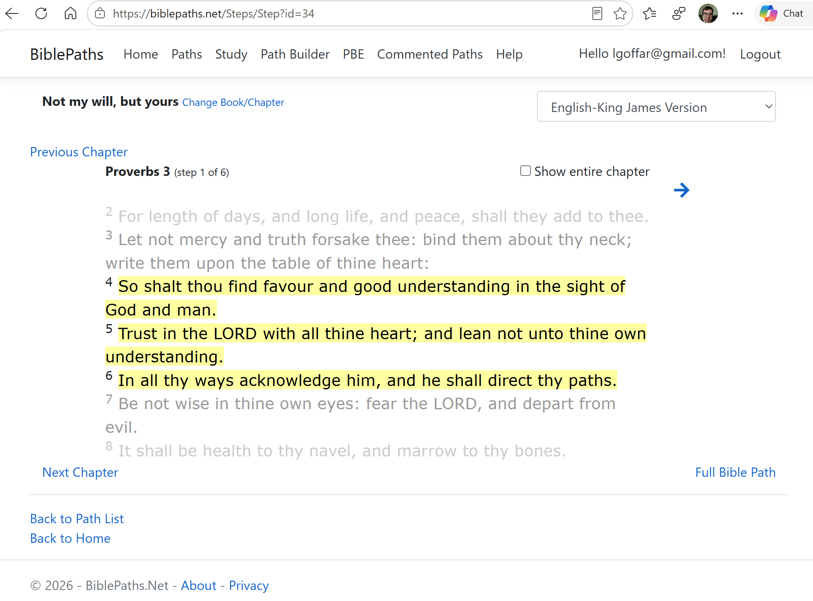

## BiblePaths.NET

**Live Site:** [BiblePaths.NET](https://biblepaths.net)

Bible Paths is a full stack crowd sourced Bible study and devotional tool. Each Bible Path is a chain of Bible verses linked together to form a simple, self contained Bible study. 

BiblePaths.NET was built to make scripture exploration more intuitive and discovery-driven. Rather than searching for a specific verse, users can wander through connections and uncover passages they might never have found otherwise.

**Tech stack:** 
- Azure hosted ASP.Net Web App with a mix of Razor and Blazor Pages
- API layer for automation
- Google and Microsoft based Authentication
- SQL Database

---

### Features

- 🔗 **User Contributed Paths** — Logged in Users are able to build/publish their own paths
- 🪪 **Social Login** — Microsoft/Google authentication. 
- 🔍 **Path finder** — Discover meaningful paths by rating, topics, and AI generated summaries
- 🤖 **AI Path Summarization** — Paths are summarized using AI for comprehensive search

---

### Screenshots

---

[← Back to all projects](/)
