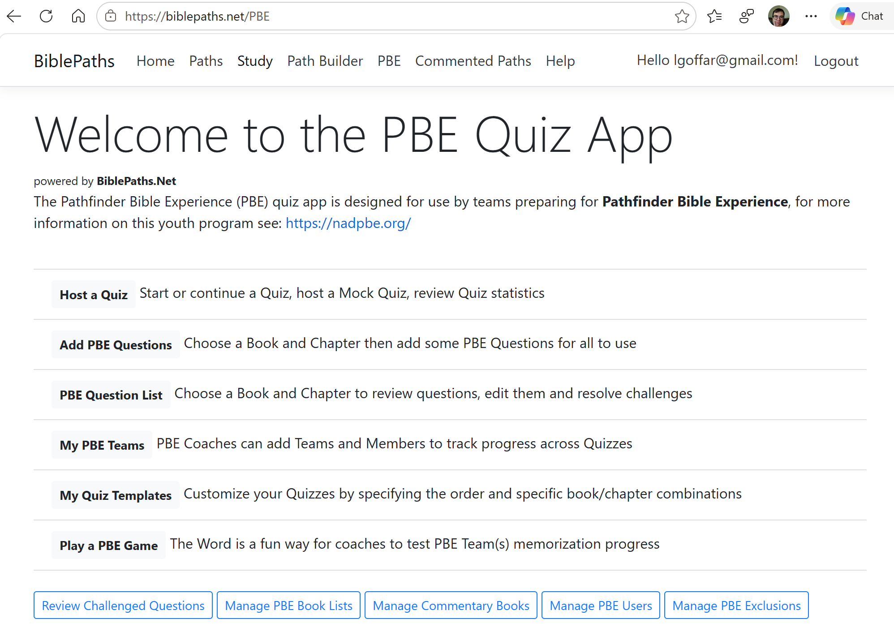
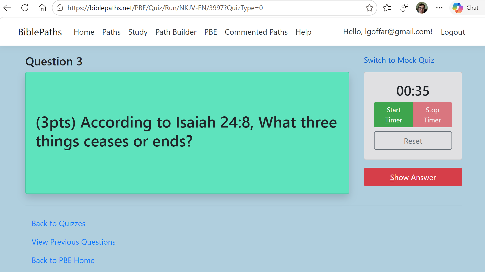

## PBE Quiz App

	
	{{ t }}
	

**Live Site:** [BiblePaths.NET/PBE](https://biblepaths.net/PBE)

powered by BiblePaths.Net
The Pathfinder Bible Experience (PBE) quiz app is designed for use by teams preparing for Pathfinder Bible Experience, for more information on this youth program see: https://nadpbe.org/

---

### Features

- 🔗 **Question Builder** — Users contribute questions grounded directly in the Bible Text
- ❓ **Quiz Experience** — Quizzes are run in app with time keeping and score tracking
- 📖 **Passage viewer** — Read referenced passages in context of a Question
- 🏷️ **Quiz History Tracking** — Teams can track their improvement over time

---

### Screenshots

Once you add images to this folder, display them like this:

---

[← Back to all projects](/)
