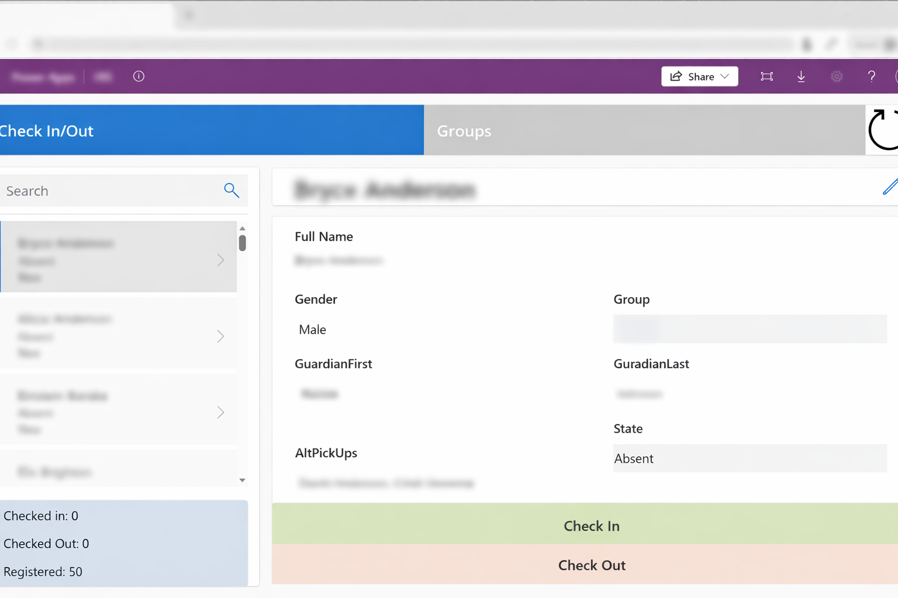
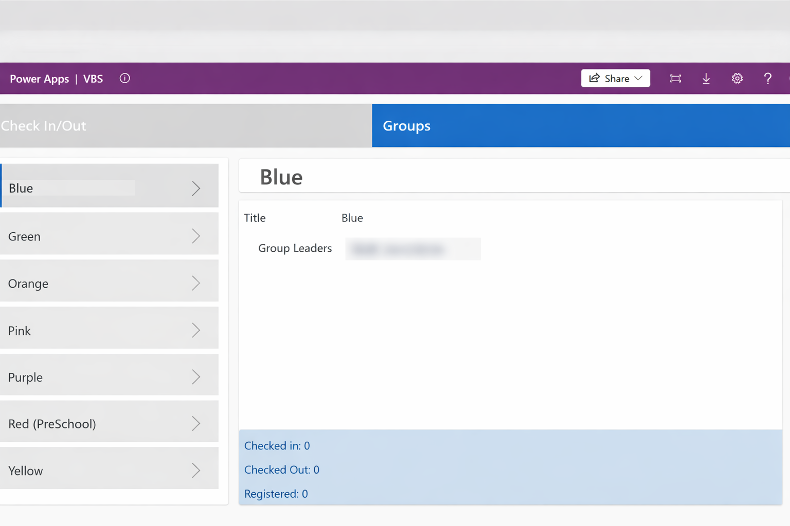

## VBS Check-In

Simple App for checking children in/out of a Vacation Bible School program each night. Backed by a series of SharePoint Online Lists this easily customizable, responsive application can be used year after year. 

---

### Features

- ✅ **Child Check in/out** — Staff can check children in/out from the event
- 📱 **Responsive App** — Staff can use their mobile phone or a laptop so they are not tied to a registration table.
- 📖 **Group Assigment** — Attendees can be added/removed from a group to improve tracking
- 🏷️ **History Tracking** — Each check in and out event is recorded an can be reviewed

---

### Screenshots

---

[← Back to all projects](/)
