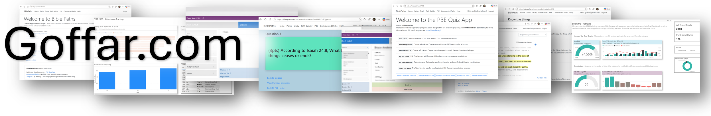

Hi, My name is **Linden Goffar**, I am an experienced technical leader with a strong background in enterprise class software. I am semi-retired from a career in "Big Tech" and always looking for something new. I am passionate about helping businesses and non-profits make better decisions through **Business Intelligence, Data Analysis** and **Automation**. You can learn more about my background in technology at our [About page](about.md), or through my[LinkedIn](https://www.linkedin.com/in/linden-goffar/) profile.

Here you will find a selection of my personal and smaller scale projects. This is just a small sampling of projects intended to give you an idea of my broad experience and skill set. 

I will always be a software guy at heart but at this stage in my life I intend to expand my work to include Data Analytics, Business Intelligence, Integration of Artificaial Intelligence (AI), and maybe some 3d Printing, CNC and wood working to keep things really interesting. 

---

## Projects

### BiblePaths.NET

Bible Paths is a **full stack web app**, for authoring and discovering crowd sourced Bible studies. Each Bible Path is a chain of Bible verses linked together to form a simple, self contained Bible study.

[View Project →](BiblePaths/project.md)

### BiblePaths.NET/PBE

powered by BiblePaths.Net
The Pathfinder Bible Experience (PBE) quiz app is designed for use by teams preparing for Pathfinder Bible Experience, for more information on this youth program see: https://nadpbe.org/

[View Project →](PBE/project.md)

### PathStats BI

powered by BiblePaths.Net
**Power BI Report** that measures Biblepaths against it's Key Performance Indicators. The primary objective of BiblePaths is to encourage Bible Study success is measured by looking across both Read Rate Growth as well as contribution rates, i.e. how many paths are being published/updated over time as the later tends to contribute to the former.

[View Project →](PathStats-BI/project.md)

### VBS Check-In/Out

Simple **Power App** for checking children in/out of a Vacation Bible School program each night. Backed by a series of **SharePoint Online** Lists this easily customizable, responsive application can be used year after year. 

[View Project →](VBS-CheckIn/project.md)

### VBS BI

**Power BI report** to track attendance trends and ensure capacity constraints are being met through the duration of an event. Backed by the [VBS Check-In/Out](VBS-CheckIn/project.md) App

[View Project →](VBS-BI/project.md)

---

*More projects coming soon.*
